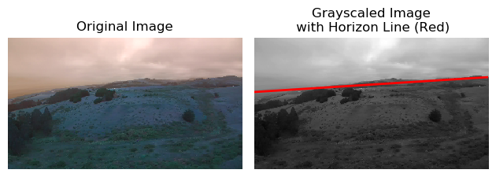
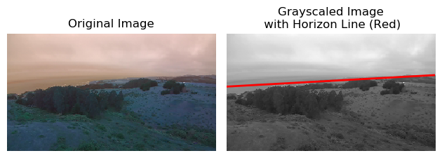

# Horizon Detection

This repository provides a simple utility for detecting the horizon line in an image, along with a script that allows for detecting horizon lines for all images in a user-specified directory. The horizon line detection utility is simplistic and makes use of Otsu's method to threshold the image and find the starting and ending points of the horizon line. For example:




# Getting Started

## Environment Setup

This repository is built using Python 3.7, and the environment can be set up in two steps:

1. Install all the required packages by using the [`environment.yml`](https://github.com/sallamander/horizon-detection/blob/master/environment.yml) (i.e. `conda env create -f environment.yml`) or by simply pip installing `opencv`, `matplotlib`, and `pytest`
2. Clone this repository and place the absolute path to the root directory of the repository on your `PYTHONPATH`, e.g. in your bash profile `export PYTHONPATH=[absolute path to repository]:$PYTHONPATH`

## Using the Horizon Line Detection Utility

The [horizon line detection utility](https://github.com/sallamander/horizon-detection/blob/master/utils.py) takes in a grayscale image and returns back the coordinates of the starting and ending points of the detected horizon line, e.g.

```python
import cv2

from utils import detect_horizon_line

fpath_image = '/absolute/path/to/image'
image = cv2.imread(fpath_image)
image_grayscale = cv2.cvtColor(image, cv2.COLOR_BGR2GRAY)

horizon_x1, horizon_x2, horizon_y1, horizon_y2 = (
    detect_horizon_line(image_grayscale)
)
```

## Using the horizon line detection script

The repository provides a [lightweight script](https://github.com/sallamander/horizon-detection/blob/master/detect_horizons.py) that can be used to detect the horizon line for all images in a user-specified directory, where the script outputs plots to a different user-specified directory in order to visualize the detected horizon lines. To use it, simply specify an input directory of images to detect the horizon line on and an output directory to save plots into. Assuming that *your working directory is the root directory of the repository*, it can be run as follows:

```python
python detect_horizons.py --dirpath_input_images /absolute/directory/path/to/images \
    --dirpath_output_images /absolute/directory/path/to/save/images
```
